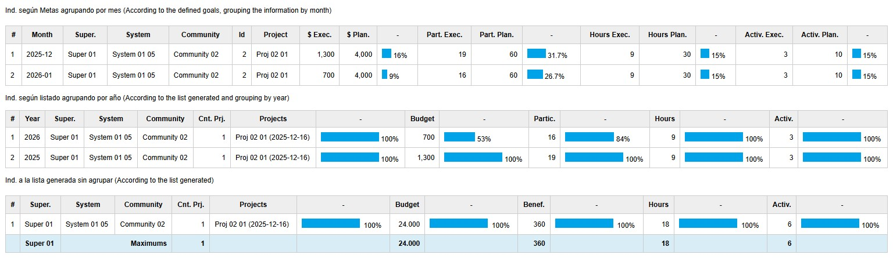
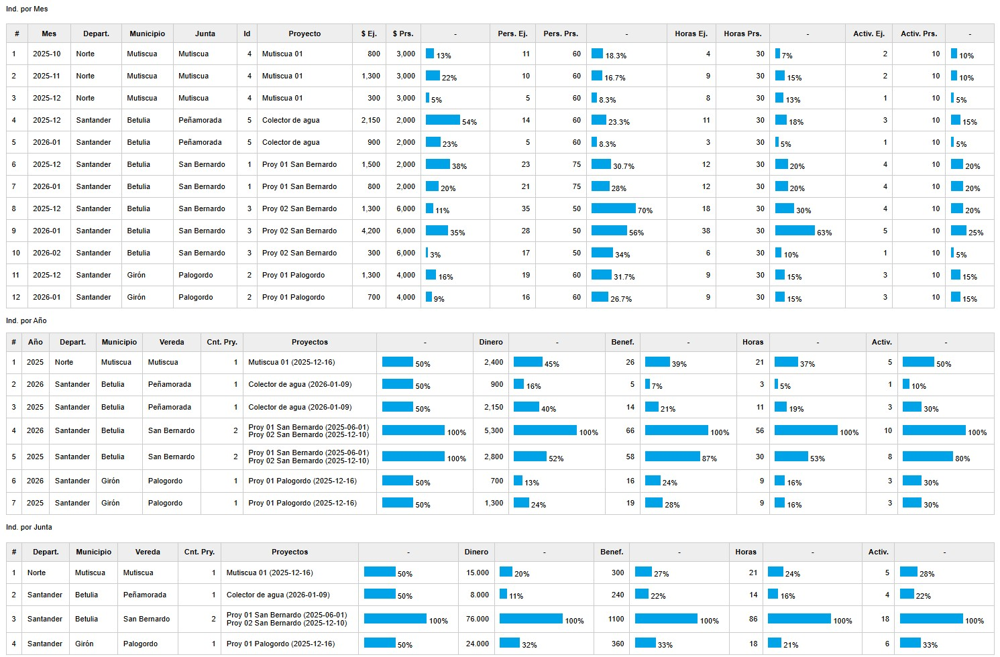
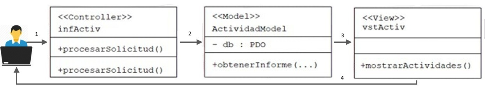

# Monthly Project Activity Report

This is one of the two pages developed using the MVC pattern. It presents a table listing project activities with the following fields:

Project, Beneficiaries, Department, Municipality, Community Board, Month, Assigned and Executed Budget, Average Beneficiaries per Month, Number of Hours Dedicated, and Number of Activities Carried Out.

# Correlational Intervention

The correlation-based intervention indicator allows estimating the percentage of coverage achieved in the areas through projects, budget, and number of participants (different from beneficiaries). An example is shown in Figure 5, where it can be observed, for instance, that Mutiscua accounts for 50% of the projects with respect to those listed, 25% with respect to the budget, and 60% with respect to the participants.

Item Indicators are defined as a measure of the degree of compliance with the goals established for each community and each intervention item. This approach enables objective and comparable performance evaluation. For a community i and an item j, the indicator is calculated using the following expression:

**Iᵢ = Real valueᵢ / Maximum value among the JACs in the reportᵢ**

The indicator Iᵢⱼ may take values greater than 1 when the defined goal is exceeded, which makes it possible to identify scenarios of overachievement and additional efficiency.

An unfiltered example is also presented.

# Project Intervention Report (MVC)

This report displays the registered projects. It was developed using the MVC pattern, in a manner very similar to what was described in <b></b>.

It shows the total number of projects, total budget amount, and total number of beneficiaries resulting from the applied filters, which depend on the role of the user generating the report, as described in <b>roles</b>.

This section details the infrastructure intervention indicators supported by the Mayor’s Office and executed by the Community Action Boards (JACs).

It includes its PHP and JavaScript controllers on the backend, as well as the model on the backend.

Model and View are implemented on the backend and do not use Markdown.An example is shown in the figure. 

The steps are as follows:

1. The user reaches the controller.

2. The controller interacts with the model.

3. The controller selects a view.

4. The view generates the output using the data that the controller obtained from the model.

The process is shown in the following figure.
 

