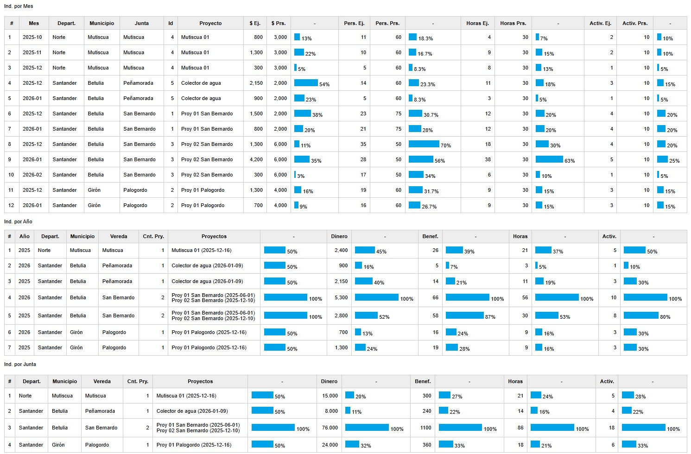
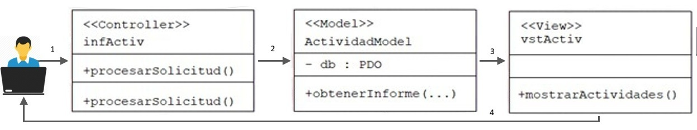

# Monthly Project Activity Report

This is one of the two pages developed using the MVC pattern. It presents a table listing project activities with the following fields:
#, Project, Beneficiaries, Department, Municipality, Community Board, Month, Assigned and Executed Budget, Average Beneficiaries per Month, Number of Hours Dedicated, and Number of Activities Carried Out.

An example is shown in the figure. The model and the view are implemented on the backend and do not use Markdown.

The steps are as follows:

1. The user reaches the controller.

2. The controller interacts with the model.

3. The controller selects a view.

4. The view generates the output using the data that the controller obtained from the model.
