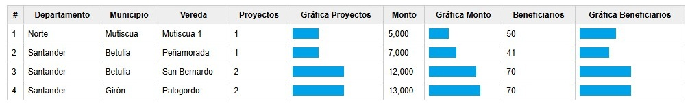

# Correlational Intervention

The correlation-based intervention indicator allows estimating the percentage of coverage achieved in the areas through projects, budget, and number of participants (different from beneficiaries). An example is shown in Figure 5, where it can be observed, for instance, that Mutiscua accounts for 50% of the projects with respect to those listed, 25% with respect to the budget, and 60% with respect to the participants.

Item Indicators are defined as a measure of the degree of compliance with the goals established for each community and each intervention item. This approach enables objective and comparable performance evaluation. For a community i and an item j, the indicator is calculated using the following expression:

**Iᵢⱼ = Real valueᵢⱼ / Maximum value among the JACs in the reportᵢⱼ**

The indicator Iᵢⱼ may take values greater than 1 when the defined goal is exceeded, which makes it possible to identify scenarios of overachievement and additional efficiency.

