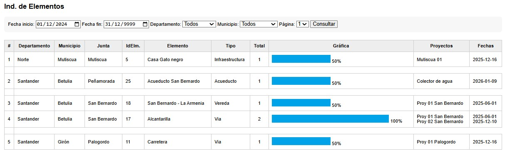

# Infrastructure Report

This report displays a graphical summary of locations by community board.

It presents a table with grouped rows by Department, Municipality, and Community Board, including the number of elements and a detailed breakdown of the type of element and the recorded quantity.

The report includes filtering options.

An example from mid-January 2026 is shown in the figure.

