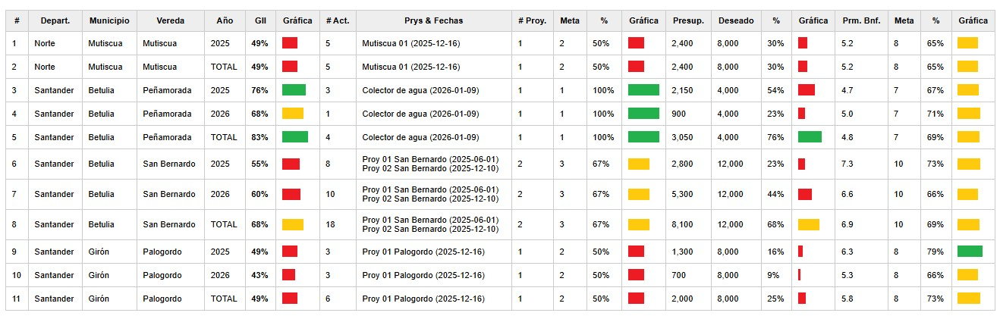

# General Intervention Indicator

The General Intervention Indicator (GII) is defined as a synthetic indicator that summarizes the overall performance of the intervention in a community. It is the most important indicator and integrates the different normalized indicators through a weighted linear combination calculated for each community. It is computed using the following expression:

**GIIᵢ = pP · Pᵢ + pT · Tᵢ + pB · Bᵢ**

Based on the following indicators:

1. Pᵢ: normalized Budget indicator

2. Tᵢ: normalized Time indicator

3. Bᵢ: normalized Beneficiaries indicator

Each component is calculated by dividing the achieved value of each project by its expected value, similarly to Equation 1. In this case, predefined goals are used, allowing comparison across the Community Action Boards (JACs). For a community i and an item j.

**Iᵢⱼ = Achieved valueᵢⱼ / Goalᵢⱼ**	

The report presents a table listing projects by Department, Municipality, and Rural Area, including the number of projects, the budget amount, and the total number of beneficiaries. For the last three items, comparative charts are also presented alongside the list.

The figure includes the following sections:

1. GII indicator

2. Number of activities carried out during the filtered time period

3. Project distribution

4. Budget distribution

5. Participant distribution

An example from mid-January 2026 is shown in the figure.

