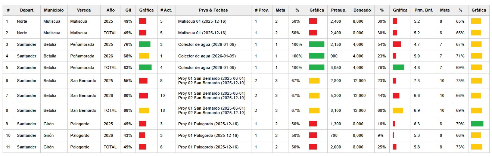

muchas gracias doctor XXX
he aprovechado para mejorar la herramienta y el documento
ahora tiene un generico, así es de mayor interes para los lectores

la bd habla de comunidades y no de juntas, esto junto con las tablas que la describen, ademas su estructura está en ingles
por tanto se cambió el codigo de los cinco indicadores y por sugerencia del ente territorial.

deje solo las figuras mas importantes
los filtros ahora si son una funcion que se invoca
se eliminó el javascript para que sea mas facil de replicar
actualicé el documento tecnico y el video, despues del min XXXX auqnue por supuesto ahora es otro

# General Intervention Indicator

The General Intervention Indicator (GII) is defined as a synthetic indicator that summarizes the overall performance of the intervention in a community. It is the most important indicator and integrates the different normalized indicators through a weighted linear combination calculated for each community. It is computed using the following expression:

**GIIᵢ = (pP · Pᵢ) + (pT · Tᵢ) + (pB · Bᵢ)**

Based on the following indicators:

1. Pᵢ: normalized Budget indicator

2. Tᵢ: normalized Time indicator

3. Bᵢ: normalized Beneficiaries indicator

Each component is calculated by dividing the achieved value of each project by its expected value, similarly to Equation 1. In this case, predefined goals are used, allowing comparison across the Community Action Boards (JACs). For a community i and an item j.

**Iᵢ = (Sumatoria(Achieved valueⱼ)/number of projectsᵢ) / Goalᵢ**	

The report presents a table listing projects by Department, Municipality, and Rural Area, including the number of projects, the budget amount, and the total number of beneficiaries. For the last three items, comparative charts are also presented alongside the list.

The figure includes the following sections:

1. GII indicator

2. Number of activities carried out during the filtered time period

3. Project distribution

4. Budget distribution

5. Participant distribution

An example from mid-January 2026 is shown in the figure.

