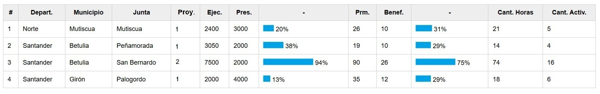

# Project Report (MVC)

This report displays the registered projects. It was developed using the MVC pattern, in a manner very similar to what was described in <b></b>.

It shows the total number of projects, total budget amount, and total number of beneficiaries resulting from the applied filters, which depend on the role of the user generating the report, as described in <b>roles</b>.

This section details the infrastructure intervention indicators supported by the Mayor’s Office and executed by the Community Action Boards (JACs).

It includes its PHP and JavaScript controllers on the backend, as well as the model on the backend.

