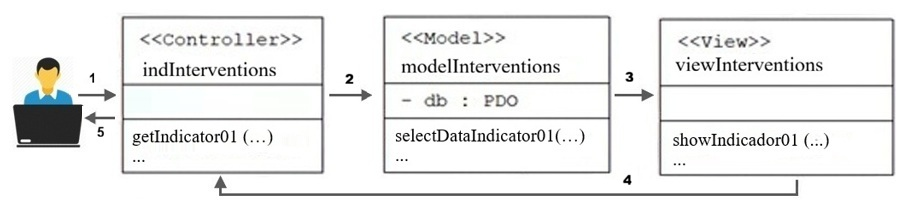

<h1><strong>Architecture</strong></h1>

The SARA architecture is composed of the following components presented in the figure:
<ol>
<li>A web application structured in model and controller layers, along with a front-end that allows coordinators to manage information through a web browser. </li>
<li>A mobile application through which JAC participants manage information related to community projects.</li>
<li>A database responsible for storing project-related information.</li>
<li>A REST API that enables data migration and integration.</li>
<li>IoT sensors that collect climatic data from the rural area.</li>
<li>A Google Maps component that allows the geographical identification of rural elements such as roads, properties, culverts, aqueducts, among others.</li>
</ol>

#  (MVC)

The following subsections describe the implemented indicators, including their structure, calculation approach, and interpretation. These indicators were 
implemented following the Model–View–Controller (MVC) architecture, as shown in Figure 2. Figure 4 presents an example of the files involved in the General 
Intervention Indicator process. The process follows the steps outlined below:
An example is shown in the figure. 

The steps are as follows:

1. The user reaches the controller.

2. The controller interacts with the model.

3. The controller selects a view.

4. The view generates the output using the data that the controller obtained from the model.

The process is shown in the following figure.
 

All indicators are generated from data using the same set of filters, which can be applied by supersystem or system, by date range and page.

[1] <a href="https://acofipapers.org/index.php/eiei/article/view/4844" target="_blank">Paper published at ACOFI Papers</a>
