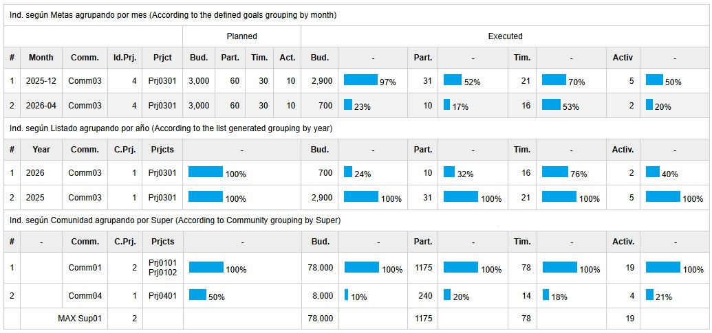

# **Interventions Indicators**

The intervention indicators quantify project execution based on predefined goals and support aggregation across communities, systems, and time periods. Information can be grouped by month, by year, or presented without temporal aggregation. 
The calculation is defined as the ratio between the observed value and the corresponding comparative value. This formulation enables objective and comparable performance evaluation for each generated record. The indicator for each item j 
is calculated as follows:  

**Indicatorᵢ = Actual valueᵢ / Comparative valueᵢ**

 The three indicators use the same columns (supersystem, system, community, projects, budget, participants, hours and activities), except that the first two incorporate the corresponding month or year column, while the first additionally includes the goals defined for each indicator. 

The comparative value i corresponds respectively in each indicator to the goal defined for the community, the maximum value between communities, 
or the maximum value in the list, so:

1. According to defined goals, grouping the information by month. For example, in row 1 it can be observed that the first community executed 1500 during the first month out of the 4000 planned for the two-month period, thus obtaining a 38% project execution with respect to the established goal. Participants, hours, and activities are calculated in the same way.

2. According to the generated list, grouping the information by year. In the example, it can be observed that in 2026 community 01 executed 2 projects, $5300 in budget, involved 66 participants over 56 hours, and carried out 10 activities. In this case, these values correspond to the highest record found in the list generated for that year and community.

3. According to the generated list by system. In this case, each row shows execution percentages calculated with respect to the highest value registered within the corresponding system. For this reason, whenever the system changes, the values used to calculate each chart are displayed beforehand. In the example of super 01, three communities distributed across two systems can be observed; for instance, the third row executed 50% of the budget executed by community 01

An example is shown in the figure, where data were filtered for a single supersystem, one system, and one community.  

An unfiltered example is also presented.

