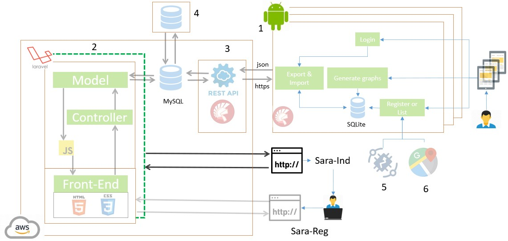
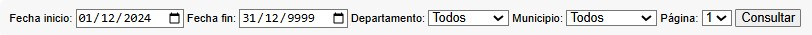

# SARA-Ind - Menu

Based on the results achieved with SARA I and the increased adoption of the system by JACs, there is a need to incorporate new functionalities aimed at users from territorial entities. 

The SARA architecture is composed of the following components presented in the figure:
<ol>
<li>A web application structured in model and controller layers, along with a front-end that allows coordinators to manage information through a web browser. </li>
<li>A mobile application through which JAC participants manage information related to community projects.</li>
<li>A database responsible for storing project-related information.</li>
<li>A REST API that enables data migration and integration.</li>
<li>IoT sensors that collect climatic data from the rural area.</li>
<li>A Google Maps component that allows the geographical identification of rural elements such as roads, properties, culverts, aqueducts, among others.</li>
</ol>

Access to information depends on the user’s administrative hierarchy, whether municipal, departmental, or national. 

This hierarchy determines whether the user can view municipal-level data, departmental data, or information from all departments, according to the filters loaded at login, as shown in Figure.

Accordingly, the following information consolidation criteria are defined: 
<ol>
<li>When consolidating data by rural areas, the corresponding municipality and department are identified.</li>
<li>When consolidating by department, the total number of municipalities and the total number of rural areas are obtained.</li>
<li>When consolidating by municipality, the corresponding department is identified and the total number of Community Action Boards is calculated and displayed in a dedicated column.</li>
</ol>

The options are:
<ol>
<li>Correlational Intervention Indicator</li>
<li>Overall Intervention Indicator</li>
<li>Municipal Intervention Indicator (MVC)</li>
<li>Monthly Activity by Project Indicator(MVC)</li>
<li>Infrastructure by JAC Indicator</li>
</ol>