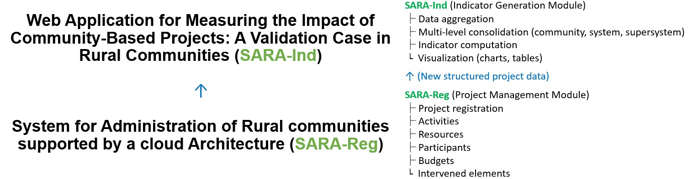
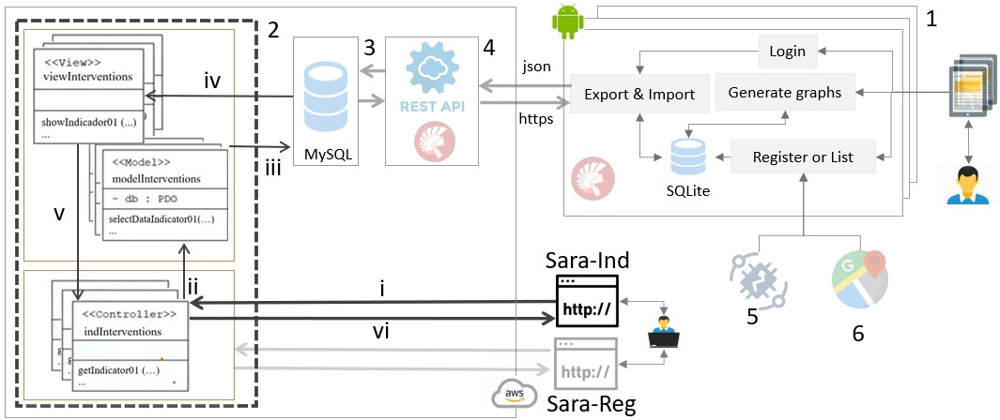
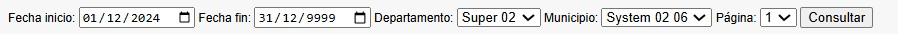

# Principal page

SARA is a service-oriented platform for the management of community-based projects. Although it was initially 
developed for rural communities organized as Community Action Boards (JACs)*, as described in [1], 
the approach presented in this work adopts a more generic structure oriented toward different types of community-based 
organizations and social intervention contexts. 

SARA-Reg has been progressively adopted in different community-based project management contexts beyond its initial 
deployment with Community Action Boards, supporting the registration and monitoring of projects in diverse 
organizational settings. In this proposal, SARA serves as the operationalizing environment in which a new 
indicator-generation module, called SARA-Ind, is incorporated.

SARA-Ind operates as an extension of the original platform and relies on the structured project data 
generated and managed through SARA-Reg. Consequently, the indicator-generation process depends on the 
prior registration, monitoring, and consolidation of project information within the base system. 
Understanding this base system is necessary to explain the integration and data flow.

In summary, SARA-Reg manages project data through the proposed management model, while SARA-Ind transforms this data into indicators through 
aggregation, computation, and multi-level visualization. This work focuses on SARA-Ind, and an example of this process is shown in the following figure.

The SARA architecture is composed of the following components presented in the figure:
<ol>
<li>A web application structured in model and controller layers, along with a front-end that allows coordinators to manage information through a web browser. </li>
<li>A mobile application through which JAC participants manage information related to community projects.</li>
<li>A database responsible for storing project-related information.</li>
<li>A REST API that enables data migration and integration.</li>
<li>IoT sensors that collect climatic data from the rural area.</li>
<li>A Google Maps component that allows the geographical identification of rural elements such as roads, properties, culverts, aqueducts, among others.</li>
</ol>

#  (MVC)

The following subsections describe the implemented indicators, including their structure, calculation approach, and interpretation. These indicators were implemented following the Model–View–Controller (MVC) architecture, as shown in Figure 2. Figure 4 presents an example of the files involved in the General Intervention Indicator process. The process follows the steps outlined below:
An example is shown in the figure. 

The steps are as follows:

1. The user reaches the controller.

2. The controller interacts with the model.

3. The controller selects a view.

4. The view generates the output using the data that the controller obtained from the model.

The process is shown in the following figure.
 

All indicators are generated from data using the same set of filters, which can be applied by supersystem or system, by date range and page.

1. <a href="https://acofipapers.org/index.php/eiei/article/view/4844" target="_blank">Paper published at ACOFI Papers</a>
