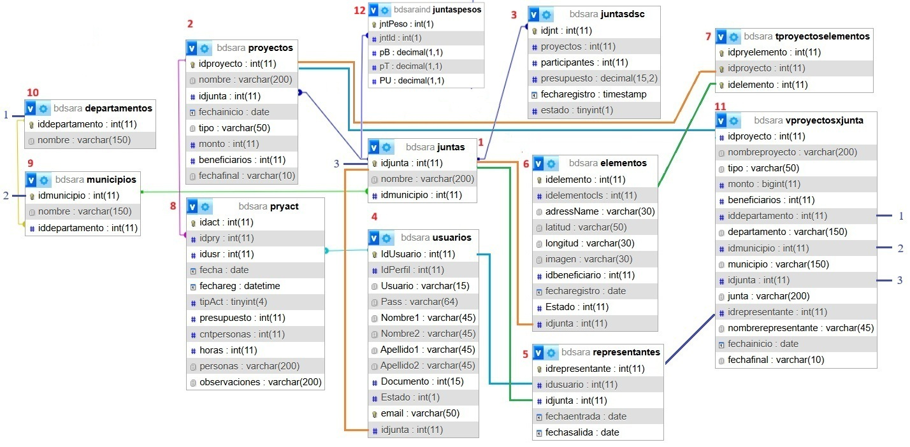

# Base de datos Sistema SARA

Laa base de datos de Sara II tiene las siguientes entidades:

1. Juntas es entidad central
2. tiene proyectos 
3. tiene descripción
4. tiene usuarios 
5. en donde uno de ellos puede ser el representante por un periodo de tiempo 
6. tiene elementos 
7. que se asocian a los diferentes proyectos 
8. que tienen actividades que son realizadas por usuarios.
9. La junta está adscrita a un municpio
10. que está adscrito a un departamento
11. Se construyó una vista que se asocia con el proyecto, el departamento, el municipio y el representante.
