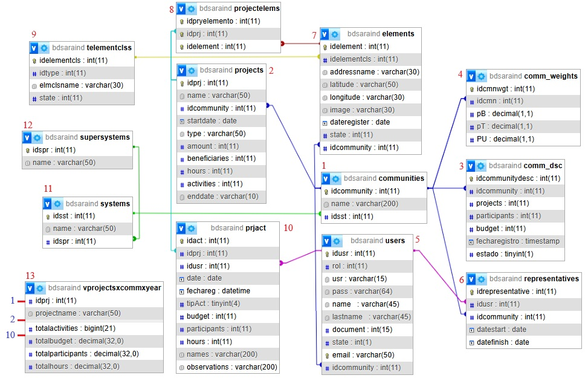
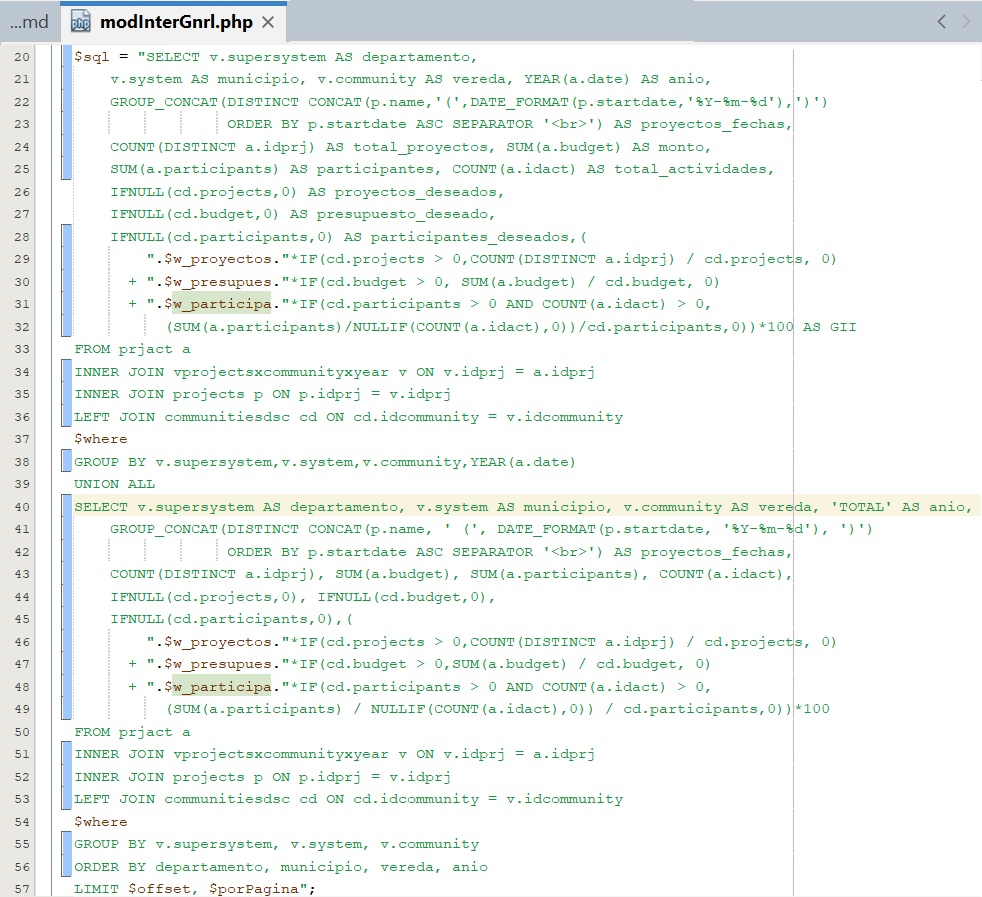
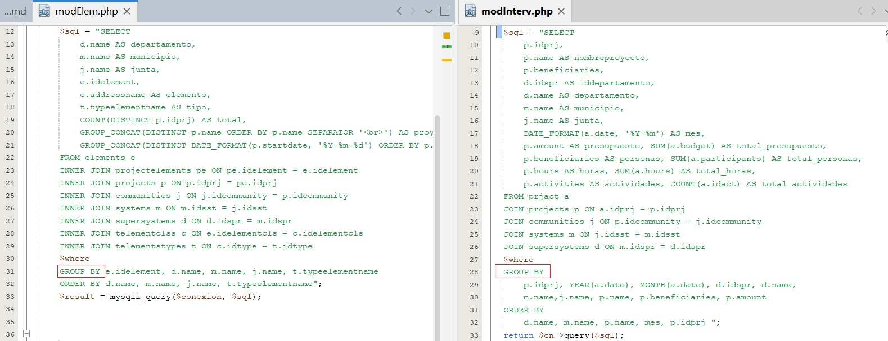

# SARA-Ind - Database

The database is presented in Figure 3 and can be understood by reading it in the order:

 1. Communities are responsible for implementing projects in coordination with entities.

 2. Projects include attributes such as community, start and end dates, budget, and beneficiaries.

 3. Community goals descriptions (comm_desc) include attributes such as goals per community in terms of number of projects, participants, and budget; this promotes 
flexibility, maintainability, and reuse across different scenarios by controlling rules through parameterized values stored in variables, such as goal thresholds 
per indicator. The structure also includes status and registration date of historical records.

 4. Each community should be assigned weights associated with budget allocation, user participation, and time dedication (comm_weights). These weights are used to 
compute an overall indicator.

 5. Users are included to determine who can access the system and the role assigned to each user.

 6. One of these users may act as a representative for a defined period.

 7. In addition, each project includes elements that are intervened by the community.

 8. These elements are associated with projects (projectselem).

 9. They have different classifications, which in rural contexts include roads, among others (telementclass).

10. Activities executed by users are recorded for each project (pryact).

11. Each community is associated with a system (systems).

12. Each system is associated with a higher-level structure (systemsuper).

13. Views such as vprojectsxcommunityxyear were generated to support the creation of the first indicator. This view integrates projects and activities data into a 
single structure (Not all attributes are shown).

MySQL functionalities are used, as illustrated by the query that generates the Indicators. The highlighted SQL commands are:

1. Consolidate data using aggregation functions such as COUNT, DISTINCT, and SUM.

2. Avoid calculation errors and NULL results by using functions such as IFNULL and NULLIF, producing more robust indicators with less code, which allows the 
comparison of two values to ensure they are not equal within a record.

3. Promote flexibility, maintainability, and reuse across different scenarios by controlling rules through parameterized values stored in variables, such as goals.

Database queries are fundamental to the process, particularly the filtering mechanisms used for the GII. For a more detailed implementation, please refer to 
the <a href="https://github.com/urbanoeliecer/Sara-Ind " target="_blank">GIT</a> repository.

SARA requires a MySQL database, a local server environment such as XAMPP, and the source code available in the <a href="https://github.com/urbanoeliecer/Sara-Ind " target="_blank">GIT</a> repository.

The system is designed to run on Windows and requires PHP and Apache (included in XAMPP) to be properly configured.

Once the environment is set up, the project can be deployed by importing the database and configuring the application according to the provided source code.

The **Conect() function** defines the database parameters and executes the mysqli_connect command.

function Conectarse()

$host = "localhost";

$user = "root";

$password = "";

$database = "bdsaraind";