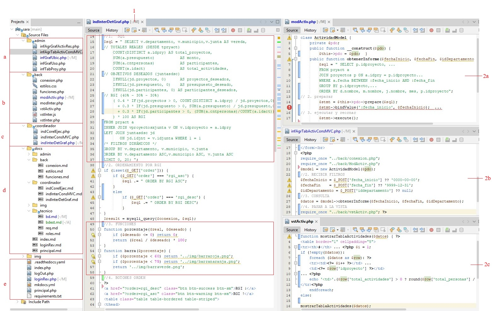

# Entorno de Programación

La figura muestra como se está programando dos informes, sin y con MVC como se observa en la figura 15, en los apartados 1 y 2. A la izquierda se observan los componentes del proyecto organizados según la jerarquía.

1 presenta el controlador de detalle del indicador RGI, encargado de construir la consulta SQL principal, procesar los resultados y preparar la información que será presentada posteriormente en la vista. Aquí se observa la construcción de la consulta SQL, una consulta que integra información real y deseada de los proyectos comunitario, los filtros, el formulario, etc.

2 presenta los tres archivos necesarios del informe mensual de actividades por proyecto 

Son un puente entre la capa de datos y la presentación y así su diseño permite separar claramente la Lógica de negocio, el acceso a datos y la representación visual para mejorar la mantenibilidad y escalabilidad. 

Estos cumplen con el rol de:

a. Controlador de análisis

b. Calcular de indicadores estratégicos para la toma de decisiones

c. Brindar la representación visual

A la izquierda es presentada los componetes del proyectos organizados según la jerarquía.

