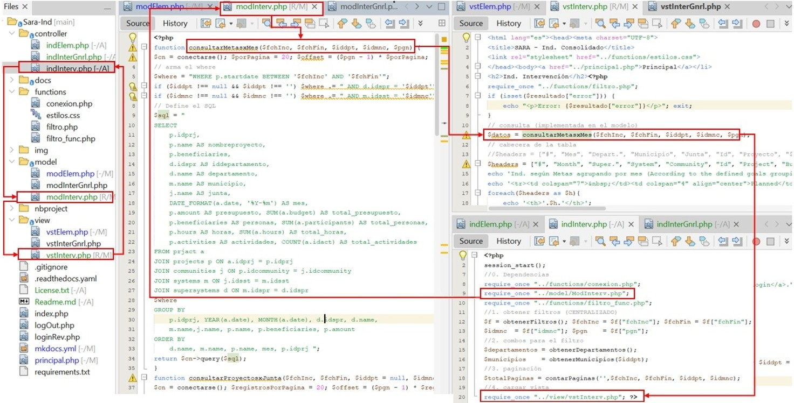

# Programming Environment

The figure shows the code of an indicator from a programming perspective. On the left side, the project structure is displayed, with its components organized according to their hierarchy.

The image presents the controller of an indicator, which interacts with the model to execute the SQL query, and the view, which receives the data and prepares the information to be displayed.

This design enables a clear separation between business logic, data access, and visual representation, thereby improving the maintainability and scalability of the system.

 They fulfill the following roles:  

a. Analysis controller

b. Calculation of strategic indicators for decision making

c. Visual representation  

