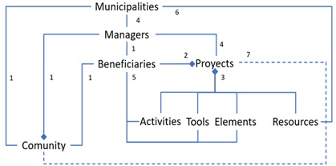

# Requeriments

SARA-Ind generates five indicators based on the records created in SARA-Reg.
A summary of SARA-Reg is presented in [https://doi.org/10.26507/paper.4844](SARA Description).

# Community management system

The proposed system is process-oriented and interconnects municipalities, communities, and in-habitants, where some act as beneficiaries or managers, 
as well as projects involving activities with tools that consume certain resources to work on elements or infrastructure. Each project requires the support 
of a manager assigned by the municipality, who ensures the proper use of the resources ad-ministered by the community. For this reason, the manager must
 have access to information that pro-vides traceability and demonstrates the achievement of the project's goal.

The system aims to enhance the management of information for community projects, addressing inefficiencies that often result in duplicated efforts and 
wasted resources, and/or a lack of accurate information. The system structure is shown in Figure 2; its description is in the following points:

1. Municipalities (systems) are entities made up of beneficiary communities.

2. Projects involve activities carried out with tools that improve elements consume resources.

3. The municipality (systems) must have a manager for to guide the projects who to work in the community.

4. Beneficiaries must assign activities, tools and elements.

5. The municipality (systems) is responsible for handling resources, it is guarantors of the communities.

6. Projects benefit the entire community.

The process is described in the activity diagram. It has three starting points based on the diamonds, corresponding to different moments:

1. When the municipality assigns a project to a community and maps its location, triggering a pending activity for the community president to accept 
the project. However, the initial step is when the community identifies the need, although this is not handled in the software.
 
2. When the community representant assigns activities, members, and/or tools, occurring when selects the project.

3. When a community member replaces the president of the community board.

