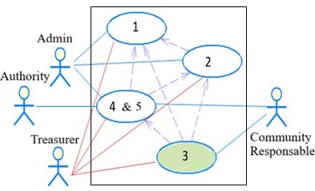

# Roles

SARA is now organized into two main modules: SARA-Reg, for project data registration, and SARA-Ind, which focuses on the  generation if multiple indicators.

In SARA-Ind, there is only one role, although it may be assigned to different municipalities and one or more departments. This role is called Administrator, and it is responsible for generating the indicators.

In SARA-Ind, a System Authority role is used for indicator generation and visualization. Depending on the assigned scope, this role may access information at the community, system, or supersystem level. In the examples presented in this work, the role is responsible for consulting and generating indicators according to the corresponding level.

In SARA-Reg, the roles are:

1. Supervisor: Validates the reported expenditure indicators.

2. Community Responsable: Registers the participants from the rural community.

3. Treasurer: Reports the amount of own funds invested.

The use cases are shown in the following figure (1 to 4 correspond to SARA-Reg, and 5 corresponds to SARA-Ind).

1. Manage communities, beneficiaries, tools, resources, and activities.

2. Manage projects.

3. Manage activities.

4. Generate reports.

5. Generate indicators, where access to community, system, or supersystem information depends on the assigned role.

